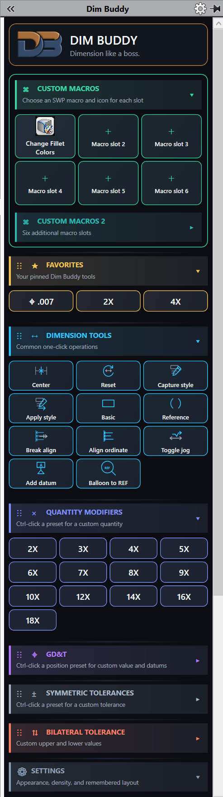
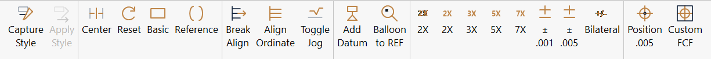
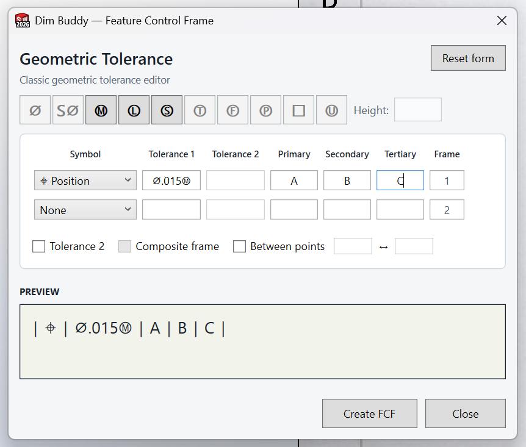

  

<h1 align="center">Dim Buddy</h1>

  <strong>Dimension like a boss.</strong> 
  A modern SOLIDWORKS add-in for faster drawing-dimension, tolerance,
  GD&amp;T, macro, formatting, and annotation workflows.

  <a href="https://github.com/vapor162/DimBuddy-Releases/raw/refs/heads/main/downloads/DimBuddy-0.9.0-beta.7.zip"><strong>Download Dim Buddy 0.9.0-beta.7</strong></a>

## The task pane

Dim Buddy keeps frequently used drawing tools visible and organized in a
compact, customizable task pane. Pin favorite commands, run custom SOLIDWORKS
macros, apply dimension presets, and build feature control frames without
digging through menus.

  

## CommandManager toolbar

The same high-use tools are available directly from the SOLIDWORKS
CommandManager for a fast, lean workflow.

  

## The classic FCF editor is back

Dim Buddy includes a purpose-built, classic-style Feature Control Frame editor
for users who prefer the fast, compact workflow of the traditional SOLIDWORKS
geometric-tolerance dialog.

Build the complete frame in one focused window. Choose the geometric
characteristic, toggle modifiers from the top button strip, enter tolerances
and datum references, and verify the result in a live preview before creating
or updating the frame.

  

- Start with an empty frame or load an existing legacy FCF for editing
- Create single-row and composite feature control frames
- Add diameter and material-condition modifiers in the correct frame order
- Define projected tolerance zones and between-points controls
- Use guarded field ordering to prevent invalid modifier placement
- Double-click an existing legacy FCF to open it directly in Dim Buddy

## What Dim Buddy does

### Dimension tools

- Center dimension text and toggle it back with another click
- Reset a selected dimension to its document defaults
- Apply Basic or Reference formatting
- Capture and apply dimension styles, including an attached FCF
- Break ordinate alignment, align ordinate dimensions, and toggle jogs
- Start native datum placement and convert balloons to `REF`

Successful operations stay silent; Dim Buddy only interrupts the workflow when
something needs attention.

### Quantities, tolerances, and GD&T

- Apply common quantity prefixes from `2X` through `18X`
- Hold `Ctrl` on supported presets to enter a custom value
- Apply common symmetric tolerance presets with one click
- Enter custom symmetric or bilateral tolerances in compact popups
- Apply common true-position presets or build a fully custom FCF

### Custom macros and workflow

- Configure twelve custom SOLIDWORKS `.swp` macro slots
- Select the macro entry point and assign a custom name and icon
- Pin frequently used tools to Favorites
- Reorder, expand, collapse, and remember task-pane sections
- Choose Dark, Light, or system-aware themes and multiple densities
- Use the task pane, toolbars, or customizable CommandManager commands

## Compatibility

- 64-bit Windows
- .NET Framework 4.8
- SOLIDWORKS 2024 or later

Dim Buddy is currently a beta. It has been tested with SOLIDWORKS 2024 SP5.0
and SOLIDWORKS 2026.

## Install or update

1. [Download the current beta ZIP](https://github.com/vapor162/DimBuddy-Releases/raw/refs/heads/main/downloads/DimBuddy-0.9.0-beta.7.zip).
2. Close SOLIDWORKS.
3. Extract the ZIP to a permanent local folder.
4. Run `Install-DimBuddy.cmd` as administrator.
5. Start SOLIDWORKS and enable **Dim Buddy** under **Tools > Add-Ins**.

The installer preserves macro assignments, custom icons, themes, favorites,
section states, and SOLIDWORKS toolbar customization during upgrades.

Because the beta installer is not digitally signed, Windows or security
software may ask you to confirm that you trust the download.

## Release information

- Current beta: `0.9.0-beta.7`
- SHA-256: `92b7287c8051f396afbe2bd292e31000c1a4dcab4c0147632292ddca78c6f26f`
- Update metadata: [`latest.json`](latest.json)

This public repository contains release packages, screenshots, and update
metadata only. Dim Buddy's source code is private.
